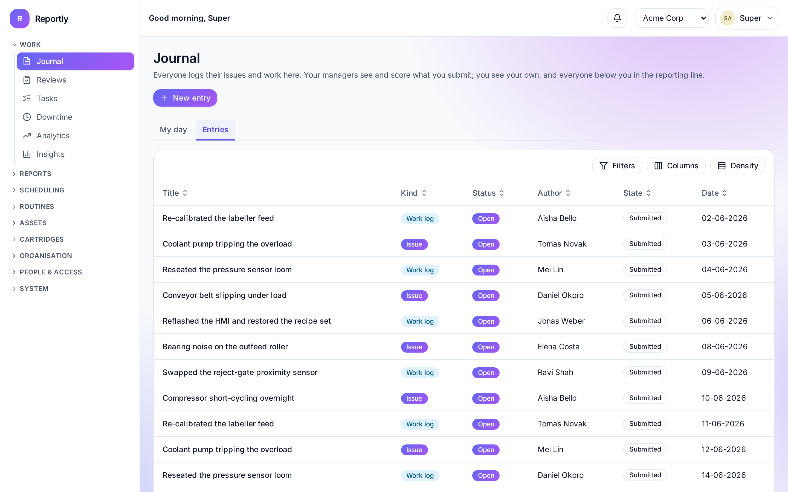
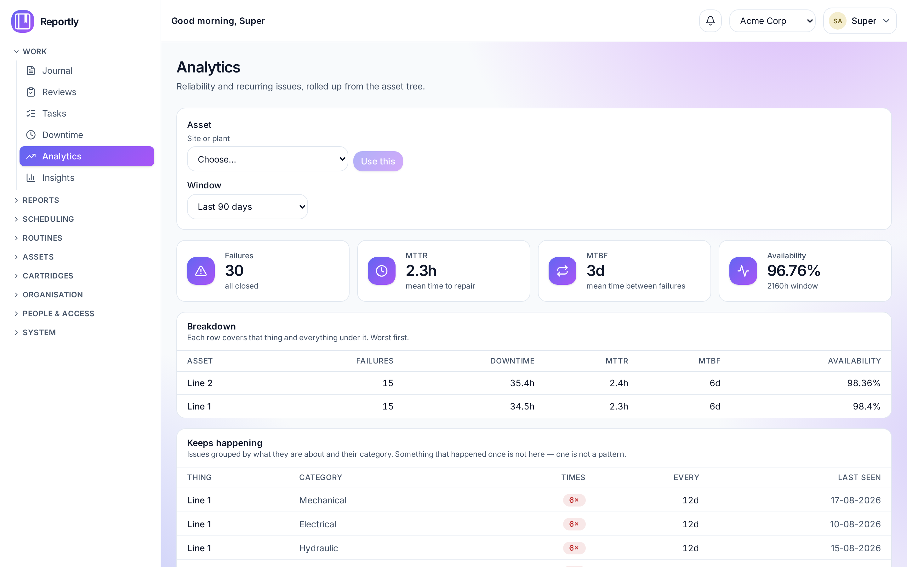
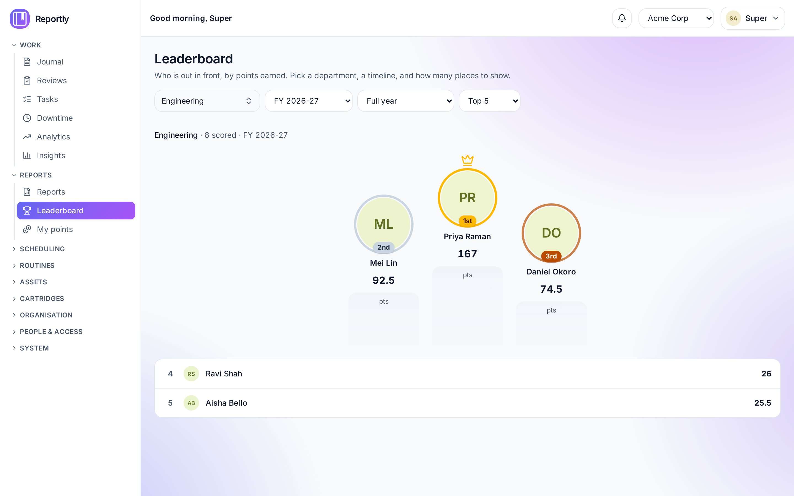
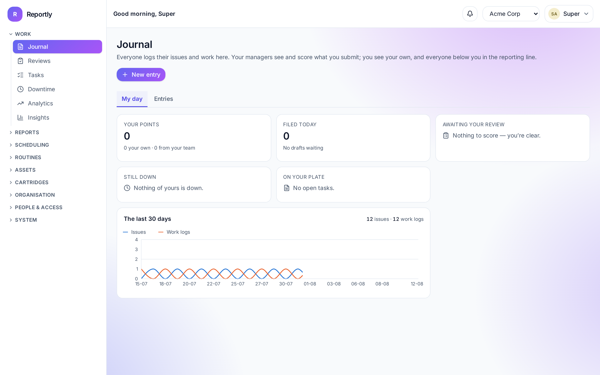

# Reportly

[](https://github.com/brijeshdave/reportly/actions/workflows/ci.yml)
[](LICENSE)

Self-hosted technical journalling for departments — across multiple companies and
locations, with group-based access control.

Your team records what broke, what they fixed, and how long the line was down.
Reportly turns that into a reviewable record, a score for the people doing the
work, and the reliability figures management asks for.



---

## What it does

**The journal.** Your team files what happened — an issue found, work done, a
machine down. Entries carry the asset, the site, a category and the department's
own tags. Attachments, a conversation that stays open after the record locks, and
handover when a shift ends with something unfinished.

**Scoring that two people agree on.** An entry is scored by its author and again
by a reviewer. The review can override, up as well as down. Points feed a
leaderboard scoped to your own reporting line, and every change is on the record
with who made it.

**Work that recurs.** Shifts with a calendar per department and site — plus a
central rota for staff who travel between them — and colleague swaps that route to
the right approver. Routines — the weekly check, the monthly clean —
with compliance tracking and month-end awards.

**The figures.** Saved report views over the journal: issues this month,
reliability by device, downtime, shift coverage, routine compliance. MTBF and
MTTR per asset subtree. Print them or export to a spreadsheet.

**Assets and devices** in a tree — site, line, station — picked a level at a time,
with bulk import and export for every master list.

**Rotables, if your team looks after any.** Printer cartridges and anything else
that cycles between the shelf, a machine and the workshop: each one identified,
its history kept, refills and repairs scored — and the points taken back when one
comes straight back faulty. Off by default and switchable per company, and the
vocabulary is yours, so it fits UPS batteries as well as toner.

**Access that is a group, not a checkbox.** Groups hold roles, and the companies
and locations those roles apply to. A new user has no access until you add them
to one: an invitation grants an identity, not permission. Ten areas, each with an
admin, an editor and a viewer role, so "keep the register up to date but delete
nothing" is a thing you can actually grant.

**Operations you can run.** Scheduled database and file backups with retention
and a restore path. An append-only audit trail. Structured JSON logs in their own
database, with per-feature levels you can turn up in production without drowning
in the rest. TOTP two-factor and OIDC single sign-on.

### A look at it

|                                                                                                                                     |                                                                                                        |
| ----------------------------------------------------------------------------------------------------------------------------------- | ------------------------------------------------------------------------------------------------------ |
|                 |                        |
| **Analytics** — failures, MTTR, MTBF and availability, rolled up through the asset tree, with what keeps recurring.                 | **Leaderboard** — points by person for a department and financial year, rolling up the reporting line. |
|  |      |
| **My day** — the journal opens here: your points, what you filed, what of yours is still down, and what is waiting on somebody.     | **Cartridges** — an optional module: the register, refills and repairs, and what each one consumed.    |

More in [docs/screenshots](docs/screenshots). They are generated from
`cli seed:demo` by [a committed script](e2e/screenshots.ts), so refreshing them
after a UI change is one command rather than an afternoon.

---

## Install it

On a fresh Ubuntu server, with Docker and a DNS name pointing at it:

```bash
git clone https://github.com/brijeshdave/reportly.git
cd reportly
scripts/install-ubuntu.sh --host reportly.example.com --email ops@example.com
```

That checks the prerequisites, generates the secrets, builds and starts the
stack, migrates, seeds, verifies the install, and prints the superadmin password
once. TLS is obtained and renewed automatically.

Full walkthrough — firewall, DNS, mail, backups, upgrades:
**[Deploying on Ubuntu](docs/ops/deployment-ubuntu.md)**.

Upgrades are `scripts/upgrade.sh`: it backs up first, rebuilds, migrates,
restarts and verifies, stopping at the first failure with the rollback command.

<details>
<summary>Run it locally instead</summary>

Needs Node 24+, pnpm 11+ (`corepack enable`) and Docker.

```bash
pnpm install
pnpm app:infra      # Postgres, Redis, Mailpit, then the API and web app
pnpm --filter @reportly/api cli reset-superadmin   # prints a password, once
```

Sign in at <http://localhost:5173> as `admin@reportly.local`.

| What           | Where                               |
| -------------- | ----------------------------------- |
| Web app        | <http://localhost:5173>             |
| API            | <http://localhost:3000>             |
| API reference  | <http://localhost:3000/api/v1/docs> |
| Captured email | <http://localhost:8025>             |

</details>

Is it healthy? `cli doctor` checks both databases, Redis, the SMTP connection,
that the attachment store is genuinely writable, and that `pg_dump` exists and is
new enough for the server. It exits non-zero, so a deploy can gate on it.

---

## Documentation

**[reportly documentation →](https://brijeshdave.github.io/reportly/)** — the same
pages as below, with search.

| Page                                                 | For                                     |
| ---------------------------------------------------- | --------------------------------------- |
| [Overview](docs/overview.md)                         | How the pieces fit together             |
| [Architecture](docs/architecture.md)                 | The pieces, and a request end to end    |
| [Worked examples](docs/examples.md)                  | An IT department, feature by feature    |
| [Deploying on Ubuntu](docs/ops/deployment-ubuntu.md) | A server, start to finish               |
| [Your first day](docs/ops/first-day.md)              | Setting it up for a real team           |
| [Scaling](docs/ops/scaling.md)                       | How it grows, and where the ceiling is  |
| [Installation](docs/installation.md)                 | Compose, Kubernetes, bare Node          |
| [Configuration](docs/configuration.md)               | Every settings screen                   |
| [User guide](docs/user-guide.md)                     | Per access level, task by task          |
| [The Journal](docs/reporting.md)                     | Filing, scoring, statuses, handover     |
| [Cartridges](docs/user/cartridges.md)                | Refillable parts, and the module switch |
| [User FAQ](docs/user/faq.md)                         | The questions people actually ask       |
| [Operations](docs/operations.md)                     | Backups, retention, troubleshooting     |
| [API](docs/api.md)                                   | Generated from the code, always in sync |
| [Environment](docs/reference/environment.md)         | Generated from the validation schema    |

Release notes are in the [changelog](CHANGELOG.md).

---

## How it is built

A TypeScript monorepo — pnpm workspaces and Turborepo.

| Path              | What                                                      |
| ----------------- | --------------------------------------------------------- |
| `apps/api`        | Fastify 5, Drizzle, better-auth, BullMQ                   |
| `apps/web`        | React 19, Vite 8, Tailwind 4, TanStack Router/Query/Table |
| `packages/shared` | Zod schemas, permissions, `can()`, the settings registry  |
| `deploy/`         | Dockerfiles, Caddy, Kubernetes manifests                  |
| `e2e/`            | Playwright, driving the real app in a browser             |

Postgres 18 (a separate database for logs, so their volume never touches the
app), Redis 8 for sessions, caches, rate limits and the queue.

Three rules the codebase holds itself to, which explain most of its shape:

- **Contracts live in `@reportly/shared`.** A schema, a permission constant, an
  error code — one definition, imported by both the API and the web app. The
  same `can()` gates a route and hides a nav entry.
- **Only `repo.ts` touches the database.** Routes handle HTTP and guards,
  services hold the rules, repositories own the SQL.
- **A stored value ships with the code that reads it.** Four separate bugs here
  have been a column, a setting or a permission that was written, displayed, and
  acted on nowhere. Static tests now fail the build when a permission is
  enforced by nothing, or a location-scoped query skips its scope helper.

---

## Contributing

Read [CONTRIBUTING.md](CONTRIBUTING.md). Before opening a pull request:

```bash
pnpm turbo run typecheck lint test build
pnpm --filter @reportly/api test:integration
pnpm --filter @reportly/e2e test:e2e
pnpm format
```

The e2e suite starts its own API and web server on their own ports, against
databases it drops and rebuilds each run — so it never touches your development
data, and a `pnpm dev` you have running is left alone.

Found a security vulnerability? Please do not open an issue —
see [SECURITY.md](SECURITY.md).

## How it was made

Reportly is vibecoded — built end to end with AI assistance.

## Licence

[AGPL-3.0-only](LICENSE) © Brijesh Dave.

If you run a modified Reportly as a network service, the AGPL requires you to
offer your users the modified source.
