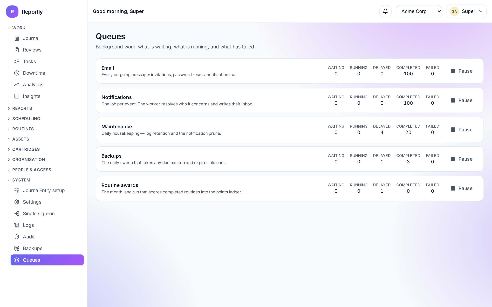

# Queues

Reportly does slow work in the background: sending mail, fanning out
notifications, taking backups, awarding month-end points. Each of those is a
**queue**, and each queue holds **jobs**.

Most of the time you never think about them. You need this page when something
stops arriving — an invitation nobody got, a backup that did not run — because a
failed job is otherwise silent.

> **This screen is off by default.** See [Switching it on](#switching-it-on).



---

## Switching it on

Add one line to `apps/api/.env` (or your compose environment) and restart the API:

```bash
QUEUE_ADMIN=manage      # view and act
# QUEUE_ADMIN=read      # view only
# QUEUE_ADMIN=off       # the default — the screen does not exist
```

`off` is not a permission check. The routes are **not registered at all**, so
`/api/v1/queues` returns 404 and the Queues entry does not appear in the
navigation. That is deliberate: upgrading a server should never silently expose a
screen that can pause the queue carrying every password reset.

`read` mounts the read-only endpoints only. On a `read` server the retry, remove,
pause and clean endpoints do not exist, whatever permissions anyone holds.

**Who then sees it** is decided by permission, as usual:

| Permission       | Can                                                              |
| ---------------- | ---------------------------------------------------------------- |
| `queues:view`    | See the queues, counts, and each job's state, attempts and error |
| `queues:inspect` | Also see a job's **payload**                                     |
| `queues:manage`  | Retry, run now, remove, pause, resume, clean                     |

Two roles ship with these: **Queue viewer** (`view`) and **Queue operator** (all
three). Grant them like any other role, under Roles.

### Why `inspect` is separate

A job's payload is its contents. An email job holds a real address and the whole
message body — for every company on the installation. Being able to answer "is
mail moving?" does not require reading other people's correspondence, so the two
are different grants. Without `inspect` the payload is never sent to the browser
at all; the panel says so rather than showing a blank.

---

## The queues

| Queue              | Carries                                                                 |
| ------------------ | ----------------------------------------------------------------------- |
| **Email**          | Every outgoing message: invitations, password resets, notification mail |
| **Notifications**  | One job per event; the worker works out who it concerns                 |
| **Maintenance**    | Daily housekeeping — log retention, notification prune, the queue check |
| **Backups**        | The daily sweep that takes any due backup and expires old ones          |
| **Routine awards** | The month-end run that scores completed routines into the points ledger |

### What the states mean

- **Waiting** — queued, not picked up yet. A number that keeps climbing means the
  workers are not keeping up, or the queue is paused.
- **Running** — being worked on right now.
- **Delayed** — scheduled for later. Repeating jobs sit here between runs.
- **Completed** — finished. Kept briefly, then trimmed automatically.
- **Failed** — every attempt failed. **This is the number to watch.**

---

## When something has stopped

**Start with Failed.** Open the queue, select the Failed tab, and open a job. You
get the error, the stack trace, and the request id that caused it — paste that id
into Logs to see everything else that happened on the same request.

Three failed email jobs all saying `connection refused` is one problem (your mail
server), not three. Fix the cause first, then retry.

### The actions

| Action      | Does                                           | Use when                                             |
| ----------- | ---------------------------------------------- | ---------------------------------------------------- |
| **Retry**   | Puts a failed job back in the queue            | You have fixed what made it fail                     |
| **Run now** | Runs a delayed job immediately                 | You do not want to wait for its schedule             |
| **Remove**  | Deletes one job                                | It will never succeed and you do not want it retried |
| **Pause**   | Stops a queue taking new work; nothing is lost | You are working on the thing behind it               |
| **Resume**  | Lets it run again                              | You are done                                         |

**Pausing Email stops password resets and invitations** until you resume it. It is
the most disruptive button here.

**Removing a job is permanent.** If it was still waiting, the work it carried
never happens and there is no record that it was dropped. Removing a _running_
job is refused outright — the worker is still going, and deleting the record
would leave work nothing is tracking.

There is deliberately **no "empty this queue"**. Bulk removal is limited to
finished jobs older than an age you give, so it cannot discard work that has not
run.

---

## Getting told, instead of looking

Every hour Reportly checks each queue and sends a **Background jobs are failing**
notification if the failed count has grown since the last check. It goes to
everyone holding `queues:view`, in every company, because a jammed queue is a
fact about the server rather than about a tenant.

It reports the _increase_, not the total — a queue holding forty old failures is
last week's news, and repeating it hourly would train people to ignore the
channel their other notifications arrive on.

This check runs whether or not `QUEUE_ADMIN` is set. Noticing that mail has
stopped is not the optional part; the screen is.

---

## FAQ

**Is it safe to turn this on permanently?**
Yes, and `read` is safer still. The feature talks to the queue system and nothing
else in the app — a test enforces that it imports no other feature — so switching
it off is a genuinely isolated change.

**A job is stuck in Running and never finishes.**
The worker holding it probably died. BullMQ hands it back automatically once its
lock expires; if the API has been restarted since, it should have moved already.

**The page says the queue backend is unreachable.**
Redis is down or unreachable. Everything on this page comes from Redis — check it
with `cli doctor`.

**Can I see which user a failed job belonged to?**
Only through its payload, which needs `queues:inspect`. The request id is on every
job without it, and Logs will tell you the rest.

**Retry did nothing.**
Retry only applies to a _failed_ job; the API refuses otherwise and says which
state it is actually in. If it fails again immediately, the cause is still there.
