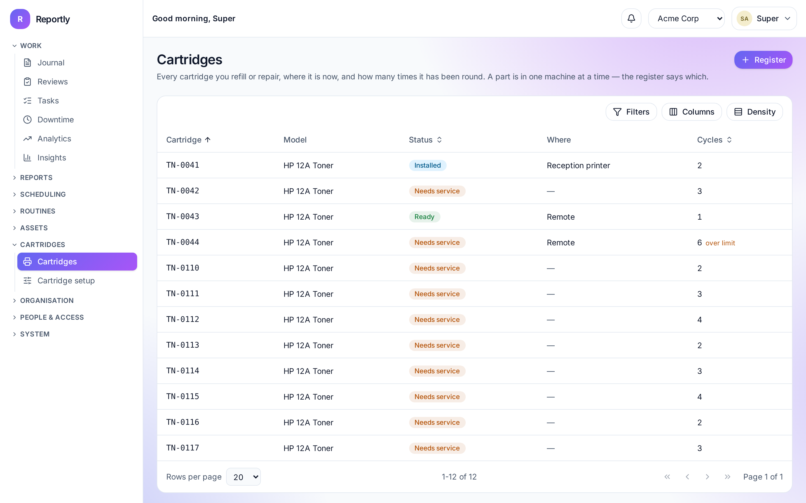
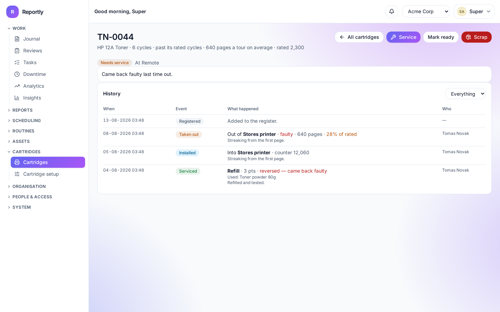

# Cartridges

Some teams look after things that go round: a printer cartridge is refilled,
fitted to a machine, used up, brought back, and refilled again. Each one has its
own identity, its own history, and a point at which it is no longer worth
keeping.

Reportly tracks those as **parts**. The screens say "cartridges" because that is
what most teams using this are refilling, but nothing underneath knows what toner
is — the vocabulary is a catalogue you fill in yourself, so a team looking after
UPS batteries, filter units or calibrated tools uses the same module with
different words.

> **This module is off by default, per company.** See
> [Switching it on](#switching-it-on). Until then it is not in the sidebar and
> its pages do not exist — which is the point: a company that does not do this
> work should not have to look at it.



---

## Switching it on

**Companies → (pick one) → Modules → Switch on.** It needs `companies:update`.

Two things are decided here:

| Setting            | What it means                                                                       |
| ------------------ | ----------------------------------------------------------------------------------- |
| **Cartridges**     | Whether this company does this work at all. Off, and nobody here sees the module.   |
| **Failure window** | How soon a part coming back faulty counts against the service before it. See below. |

It is per company, not per server: one company on an installation can refill
cartridges while another never sees the word.

Switching it **off** deletes nothing. The cartridges, their history and their
points stay exactly where they are, out of reach until it comes back on.

---

## The lifecycle

A part is always in exactly one of four states, and the screen only offers the
move it can actually make.

```
  needs service ──service──▶ ready ──install──▶ installed
        ▲                      ▲                    │
        │                      └──mark ready────────┤ book in
        └──────────────────────────────────────────-┘
        └──────────── scrap ──────────▶ scrapped
```

**Needs service** — on a shelf and _not_ usable: newly collected, or just back
from a printer. Refill or repair it first.
**Ready** — serviced and deployable. **The only state an install accepts.**
**Installed** — in a machine. A part is in one machine at a time.
**Scrapped** — retired. The only state it never leaves.

> **Why two shelf states.** These were one state called "in stock", which was two
> answers wearing one name: a cartridge just refilled and a cartridge sitting
> empty looked identical, and both could be installed. Whether a part is usable
> is the question this module exists to answer, so it is the status.

**Registering** asks which of the two it arrives in. A new cartridge from the
supplier is _ready_; one collected from a printer for refilling is not, and that
is the default — a part wrongly marked ready gets installed empty, which costs
more than a click.

**Mark ready** is for a cartridge that came off working and needs nothing — a
printer retired, a wrong fit spotted early. It is the only way to reach _ready_
without recording a service, and it exists precisely so nobody invents a refill
to move a part along.

Three refusals are worth knowing about, because they are deliberate rather than
oversights:

- **A part that does not fit is refused.** Compatibility is a property of the
  model — "an HP 12A fits an M404" — so it is stated once rather than per
  printer. A cartridge in the wrong machine will not work whatever the record
  says.
- **Nothing goes back into a printer without being made ready.** It is either
  serviced, or **marked ready** — which exists precisely so a cartridge that came
  off working has an honest way back. Forcing a service record to move it would
  pay somebody for work nobody did.
- **A part cannot be scrapped while it is installed.** Book it back in first; a
  part inside a machine is still inside it.

---

## The register

A table like every other register in Reportly — the server pages, sorts and
filters it. Filter by **status** for the workshop queue, by **model** for one
kind of cartridge, or search the identifier. A part past its rated cycles is
flagged in the Cycles column.

---

## Registering one

**Cartridges → Register.** Needs `parts:manage`.

The **identifier** is the label your team writes on the part. It has to be unique
within the company, because it is how a person at the printer and the record in
Reportly agree they are talking about the same object.

Every part points at a **model**, which is what carries the compatibility list and
the rated cycle count. Add models first, under **Cartridge setup**.

---

## Recording a refill or a repair

**Open the part → Service.** Needs `parts:service`.

Available on any cartridge on a shelf, whether it is waiting for work or already
ready — so the first refill of one you have just registered takes two clicks, and
a top-up before it goes out is recordable too. Refused only while it is inside a
machine (book it back in first) or once it has been scrapped.

**Recording a service is what makes a cartridge ready.** Pick what was done, and enter
what it used — toner in grams, a drum as one each. Leave a box empty for anything
you did not use.

The consumables offered are the ones that kind uses — a refill lists toner and a
repair lists the spares, so neither offers the other's. See
[what a kind uses](#what-a-kind-uses).

Two things the form deliberately does not do:

- **It does not ask what the job is worth.** The points come from the model and
  the service kind, resolved on the server, so what you see and what the ledger
  pays cannot drift apart.
- **It does not touch stock.** This module records what a job consumed. It has no
  stock levels, no reorder points and no low-stock warnings, and it must never
  look as though it knows what is left in the cupboard.

Recording a service puts the part back in stock and adds one to its cycle count.

---

## A cartridge's history

Open any cartridge and its whole life is one table, newest first: registered,
installed into a printer, taken out with how it ended and what it printed,
refilled or repaired with what that used and what it paid.

Installs and services used to sit in two lists side by side. That reads fine and
analyses badly — "was it refilled before or after that printer chewed it?" is a
question about one sequence, and two lists leave you interleaving them by eye.

Filter it by **event** to see only the services or only the tours of duty, and by
**printer** once the cartridge has been in more than one. A reversed service keeps
its place with the reversal shown beside it; nothing is ever removed from the
record.

---

## Page counts

A cartridge that gives 2,000 pages one time round and 600 the next is telling you
something. Reportly records what each tour of duty printed, and compares it with
what the model is rated for.

### Recording it

**When you install it**, type the printer's own page counter. **When you book it
back in**, type it again — the difference is what the cartridge printed.

Two readings rather than one "pages printed" box, because whoever books a part in
can read today's counter and cannot know what it said when the cartridge went in
weeks ago, quite possibly under somebody else. Each person types what is in front
of them and Reportly does the subtraction. The book-in form shows the opening
reading, so you can see both numbers together.

Where a machine has no counter to read, the form asks for the page count directly
instead. Both are optional: a team that records neither still gets a working
module, and the tour simply says "pages not recorded".

### Reading it

Each finished tour shows what it printed, and — when the model has a rated
figure — what fraction of it that was.



The cartridge above is the awkward case worth understanding. It was refilled,
went out, and came back faulty three days later having printed 640 pages against
a rated 2,300 — so the refill's points were reversed, and both the award and its
reversal stay on the record.

The part's header carries the average across its measured tours, so a cartridge
that is quietly declining is visible before it fails outright. Tours nobody
measured are left out of that average rather than counted as zero, which would
make a healthy part look like a failing one.

**"Meter reset — pages unknown"** means the closing reading was lower than the
opening one. That is a counter that was reset or a printer that was replaced, not
negative pages. Reportly keeps both readings exactly as they were typed —
correcting them would destroy the evidence — and declines to report a number it
cannot stand behind.

### What it does not do

**Nothing to points.** A poor yield is shown, and highlighted below half the
rated figure, and that is all. It measures what people printed as much as it
measures the refill, and the reversal already covers a cartridge that genuinely
did not work. Like the rated cycles: compared against, flagged, never enforced.

---

## Points, and getting them back

A refill or a repair pays into **the same points ledger** as journal work and
routines. That is deliberate: a point earned refilling a cartridge has to be
comparable with a point earned filing work, or the standings mean nothing. They
show on **My points** under the **Cartridges** source.

What it pays is the model's rate for that kind of service, falling back to the
kind's own default — so "Refill" can be worth 3 on a small cartridge and 5 on a
big one without inventing a second service kind.

### When a part comes straight back faulty

Booking a part in asks how the tour ended. **Faulty** is a decision, not a note:
if the part lasted no longer than the company's **failure window**, the points for
the service before it are taken back, and the person who did it is told.

Three things about that:

- **The window matters.** Outside it, the part wore out rather than the refill
  being wrong. Docking somebody two months later for a cartridge that ran dry is
  how a scoring scheme stops being trusted. Setting the window to **0** switches
  the reversal off entirely.
- **Nothing is deleted.** The reversal is a second, negative entry sitting beside
  the original — both stay on the ledger and on the part's history. A score that
  drops with nothing to show for it is worse than one that shows the award and
  its reversal side by side.
- **It happens once.** If the same cartridge goes out and fails again with no new
  service in between, nothing further is taken back. There is nothing new to
  reverse.

---

## Cartridge setup

**Cartridges → Cartridge setup.** Reading it needs `parts:read`; changing it needs
`parts:configure`.

| Tab               | What it holds                                                                    |
| ----------------- | -------------------------------------------------------------------------------- |
| **Models**        | The kinds of cartridge: what each fits, its rated cycles and pages, what it pays |
| **Service kinds** | What can be done to one — Refill, Repair, whatever you call it — and its value   |
| **Consumables**   | What gets used up: toner powder, drums, blades, chips, and the unit each is in   |

Nothing here is ever deleted. A service kind that scored somebody's work has to
survive, or the history it scored stops meaning anything — so retiring one marks
it **no longer offered** and leaves every past record intact.

### What a kind uses

**Cartridge setup → Service kinds → Uses.**

Each kind says which consumables it may take, and how much:

| Column    | Meaning                                                                   |
| --------- | ------------------------------------------------------------------------- |
| tick      | This kind may use it. Untick it and it is not offered, and not accepted   |
| **least** | Above zero makes it required — a refill that used no toner did not happen |
| **most**  | A ceiling, so a slipped decimal is refused rather than recorded           |

So a Refill can be set to toner only, at least 1 and at most 2, while a Repair
lists the drum, blades and chip with none required — a repair may be a repair
without any spare at all.

Tick nothing and the kind is **unrestricted**: everything offered, nothing
required. That is how every kind behaved before these rules existed, so adding
them changed no kind already in use.

The rules are enforced when the service is recorded, not merely in the form — a
stale tab is still refused, and told which consumable and which kind.

### What a model fits

Compatibility is by **device type** — "an HP 12A fits an M404" — so it is stated
once rather than per printer. The types come from
**Journal setup → Device types**, where they belong to a department; if the
machine you want is not in the list, add it there first.

> **Device types, not asset types.** The two sit near each other in the
> vocabulary and are easily confused. **Assets** are the structural tree — plant,
> line, station, building. **Devices** are the machines you report on, each
> standing at an asset. A printer is a device, so a printer type is a _device_
> type. A part is installed into a device, and an asset type will never appear in
> this list.

Use **Fits** on a model's row to change it later. A model that fits nothing says
so, and every attempt to install a part built on it will be refused until it
fits something.

### Rated cycles and rated pages

A model may say how many services its maker rates it for, and how many pages one
charge should produce. Both are optional, and leaving the page figure empty gives
you page counts without a comparison rather than a comparison against zero. Passing that number
**warns and never refuses**: the figure is an opinion, and the technician holding
the part has better information. When a part crosses it, whoever may scrap parts
is told once, and the part is flagged wherever it appears.

---

## Reports

Under **Reports**, in a **Cartridges** tab of their own. All five print and export
to a spreadsheet like every other report, and can be saved as views.

| Report                        | The question it answers                                            |
| ----------------------------- | ------------------------------------------------------------------ |
| **Cartridges — the register** | What do we have, where is it, how many cycles has each done        |
| **Cartridge services**        | What was refilled or repaired, by whom, what it used, what it paid |
| **Consumable usage**          | How much toner, how many drums and blades went in this period      |
| **Cartridge workload**        | Who serviced how many, what they used, and how much came back      |
| **Cartridge failures**        | What came back faulty, after whose refill, and who took it out     |
| **Cartridge health**          | Which cartridges fail or yield badly — the ones to retire          |
| **Printer health**            | Which _printers_ eat cartridges                                    |

**Cartridge workload** answers "who did what". One row per person: how many
services, split by kind, how many distinct cartridges, what they consumed, and —
the column that makes it more than a tally — **how many of their services came
back faulty**. Twelve refills is not a fact about anybody until you know whether
they held up; the same number with three returns and with none describe two
different technicians. It counts a comeback whether or not the points were
reversed, because a cartridge that failed a month later still failed, and the
reversal only fires inside the failure window.

**Cartridge failures** is the one that answers "did the work we did hold up". Each
row is a faulty return: how long it lasted, what it printed, the refill or repair
it had been given first, **who did that**, **who took it out**, and whether the
points were reversed. A cartridge that failed with no service before it says
"never serviced" rather than leaving a blank — it arrived broken, which is not
somebody's work gone wrong.

Naming the person is not about blame; the reversal has already moved the points.
It is so a pattern in _whose_ refills come back is visible at all, which is the
only way to spot somebody who needs showing something rather than docking.

The last two are the ones to look at when something feels wrong, and they are
deliberately separate. A cartridge failing repeatedly is a cartridge problem;
three **different** cartridges failing in one printer is a printer problem, and
only grouping by machine tells them apart. Both list the worst first, because a
report meant to surface trouble should not ask you to sort it.

**Filtering by person.** The four reports that have a person to narrow by —
services, consumable usage, failures and workload — offer a **Serviced by**
picker. The register and the two health reports do not: a cartridge has no
technician, and offering a filter that changed nothing would read as a broken
filter rather than an inapplicable one.

A reversed service shows in the log with its reversal noted rather than netted
away, the same as everywhere else.

The whole tab is absent for a company that does not use the module, and running
one of these reports there is refused rather than answered with an empty table.

### Something to look at

The health reports rank what they are given, so with two cartridges and one
refill they have nothing to say. To see them working:

```bash
pnpm --filter @reportly/api cli seed:demo-cartridges
```

Ten invented cartridges with tours of duty and services, built from **your own**
models, printers, service kinds and consumables — two of which fail early every
time, so the health reports have something to find. Safe on a database holding
real work, unlike `seed:demo`, because it adds only cartridges. Every identifier
is prefixed `DEMO-`, and the command prints the two statements that remove them
again.

---

## Who can do what

| Permission        | Allows                                                            |
| ----------------- | ----------------------------------------------------------------- |
| `parts:read`      | See parts, their history, and what has been done to them          |
| `parts:deploy`    | Install one on a machine, book it back in, put it back on a shelf |
| `parts:service`   | Record a refill or a repair — the act that pays points            |
| `parts:manage`    | Register parts, correct them, scrap them                          |
| `parts:configure` | The catalogues: models, compatibility, service kinds, consumables |

Two ready-made roles use them: **Cartridge technician** (read, deploy, service)
and **Cartridge admin** (all five).

`service` is separate from `deploy` on purpose. Installing a cartridge and
recording that you refilled it are different acts, and only one of them pays.

None of these do anything unless the company has the module switched on. The
setting says whether this company does this work; the permission says who does
it, and neither substitutes for the other.

---

## Notifications

Two, both narrow:

| Notification                    | Who is told                               | When                                             |
| ------------------------------- | ----------------------------------------- | ------------------------------------------------ |
| Points for a service taken back | The technician whose service was reversed | A part came back faulty inside the window        |
| A part passed its rated cycles  | Whoever may scrap parts (`parts:manage`)  | The service that takes it past its model's limit |

Both can be turned off per person under **Profile → Notifications**, within
whatever the administrator's matrix allows. See
[Notifications](notifications.md).

---

## Questions

**Can I track something that is not a cartridge?**
Yes, and it is designed for it. Nothing in the module names toner or printers:
what a part is, what can be done to one, and what that uses up are all catalogue
entries. The screens are labelled "Cartridges" because that is what most teams
here are refilling.

**Does it manage stock?**
No, deliberately. It records what each job consumed. There are no balances, no
receipts and no reorder points anywhere in it — a half-built inventory system that
looks authoritative and is not would be worse than none.

**Somebody scrapped a part by mistake.**
Scrapping is final by design, and there is no un-scrap. The record and its whole
history survive, so nothing is lost; register the physical part again under its
own identifier if it really is still in service.

**Why is a printer missing from the install list?**
The list holds only machines this cartridge's model fits — a desktop or a switch
will never appear there. If the printer you want is missing, either its model
does not list that printer's **type** yet (fix it with **Fits** on the model's
row under Cartridge setup → Models) or the printer has not been registered as a
device of a fitting type.

**The device type I want is not in the "Fits" list.**
Device types are not part of this module — they are the kinds of machine your
company keeps, and they live in **Journal setup → Device types** under a
department. Add one there and it appears here.
