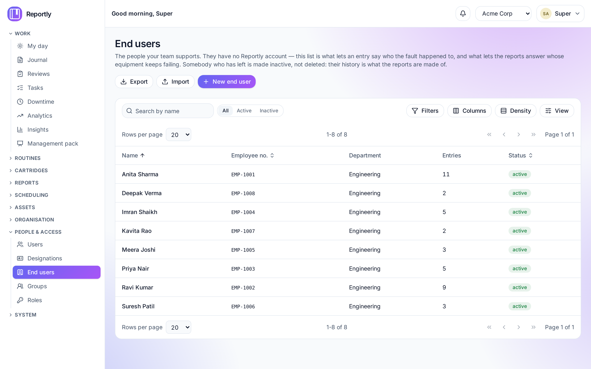
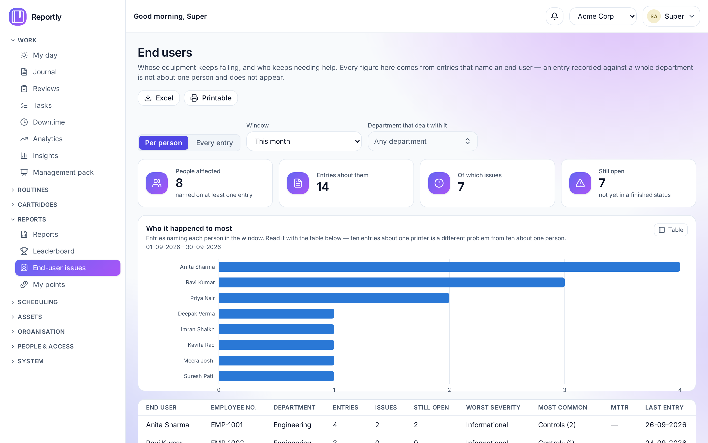

# End users

The people your team **supports** — the ones an issue happens _to_. They have no
Reportly account, they never sign in, and they exist so that an entry can say whose
machine failed and so the reports can answer **whose equipment keeps failing**.

Find them under **People & access → End users**.

---

## Why they are a separate list

The journal's person field used to offer the **account** list, so technicians tagged
colleagues — because that was the only list there was. The person the work was about
was not recorded at all, which is why nothing could answer the most ordinary question
a helpdesk gets asked.

An end user is not a user. They have no password, no company access, no place in the
reporting line, no points and no inbox. A flag on the staff list would oblige every
screen that reads people — the assignment picker, the reporting line, the
leaderboard, review chains, rosters — to exclude them one at a time, and the first one
that forgot would be a leak. Their own list makes the exclusion structural: they appear
on this page, in the journal's **End user** field and in the end-user reports, and
nowhere else.

---

## What a record holds

| Field               | Notes                                                                                            |
| ------------------- | ------------------------------------------------------------------------------------------------ |
| **Full name**       | Required.                                                                                        |
| **Employee number** | Required, and **unique within the company**. It is what tells two people of the same name apart. |
| **Department**      | Optional. Decides which entries can offer them — see below. Leave it empty for a contractor.     |
| **Notes**           | Anything worth knowing: where they sit, which shift, the machine they always use.                |
| **Status**          | `Active` is offered in the journal; `Inactive` is not. New people are active.                    |
| **Entries**         | Read-only: how many entries name them. This is the number the whole feature exists to produce.   |

**Search by either.** The box above the register, and the **End user** picker on a
journal entry, both match the **name or the employee number** — the number is shown
beside the name in the picker for exactly that reason. Whoever is asking has one of
the two, and it is usually whichever is printed on the machine in front of them.

**Employee numbers are unique per company, not across them.** Two companies on one
installation may each have an `EMP-1001`, and they are different people.

---

## Somebody who has left

Set them **Inactive**. They come out of the journal's picker straight away and every
entry that names them is untouched — which is the point: those entries are what the
reports are made of.

**Deleting is refused once anybody is named on an entry.** The screen says so before
you try, and the server refuses it if you do. A deletion would leave those entries
pointing at nobody and quietly take them out of every figure. Somebody added by
mistake and named on nothing can be deleted outright.

---

## In the journal

On an entry, under **What is it about?**:

1. Choose the **department** the entry concerns.
2. The **End users** list narrows to the people in it.
3. Name whoever it happened to.

**Naming people replaces the department.** The entry is then recorded against those
people rather than against their whole department — the department is narrowing the
list, not recording anything. Without that rule every issue would be counted twice,
once against the individual and once against everybody around them. Clear the last
name and the department target comes back.

With **no department chosen** the whole active list is offered, because an issue about
a contractor or a visitor has no department to narrow by.

---

## The reports

**Reports → End-user issues** has both questions on one page, with a window and a
department filter:

- **Per person** — a row for each person, ordered by who it happened to most: entries,
  issues, how many are still open, the worst severity it reached, what keeps happening
  to them, the median wait for a resolution, and when they were last on an entry.
- **Every entry** — a row per entry per person named. An entry naming three people is
  three rows; an entry recorded against a whole department is not here at all.

Both export to **Excel** and to a **printable** page, and both exist in the Reports
library as report sources — so you can build a saved view, share it with a group, and
schedule it like any other report. The management pack has an **End users** section
carrying the same two things.

**A median wait of "—" is not zero.** It means nothing had been resolved yet. A zero
there would claim everything was fixed instantly.

---

## Loading the list

**Import** takes an `.xlsx` or `.csv` with these columns:

| Employee number | Full name    | Department | Notes                  | Status |
| --------------- | ------------ | ---------- | ---------------------- | ------ |
| EMP-1001        | Anita Sharma | Accounts   | 2nd floor, by the lift | active |

- **Matched on the employee number.** A number already on the list is corrected; a new
  one is added. So re-importing an edited export is an update, not a pile of duplicates.
- **All or nothing.** If any row is wrong nothing is written, and every problem comes
  back with its line number.
- **A department is named, not numbered** — and a name that does not exist is reported
  rather than created. A typo that silently invents "Acounts" is how a master list rots.
- **A file naming the same employee number twice is refused**, rather than letting the
  second row quietly overwrite the first.

**Export** gives the same shape back, so the export is also the template.

---

## Who may do what

| Permission         | Allows                                     |
| ------------------ | ------------------------------------------ |
| `end-users:read`   | See the list, and name people on an entry. |
| `end-users:create` | Add somebody.                              |
| `end-users:update` | Correct somebody, or make them inactive.   |
| `end-users:delete` | Remove somebody who is named on nothing.   |
| `end-users:import` | Load the list from a spreadsheet.          |

`end-users:read` is held by **everybody who files**, because naming the person a fault
happened to is part of filing an entry. The four that change the list are held
separately, like the rest of the master data — a journal administrator can name people
on entries and nothing more.

Four shipped roles carry them, so nobody has to assemble one:

| Role                     | What it is for                                                                 |
| ------------------------ | ------------------------------------------------------------------------------ |
| **End users viewer**     | Reads the register and the two reports. For answering "whose laptop is this?". |
| **End users editor**     | Adds people, corrects them, makes a leaver inactive. No bulk import.           |
| **End users admin**      | The above, plus the spreadsheet import.                                        |
| **End users superadmin** | The above, plus deleting somebody who is named on nothing.                     |

Deleting sits a tier above administering, as it does everywhere in Reportly: an edit
shows up in the history, and a deletion takes the history with it.

The two reports have their own keys — `reports:view:end_user_summary` and
`reports:view:end_user_issues` — so the figures can be given to a manager without
handing over the ability to edit the register.
