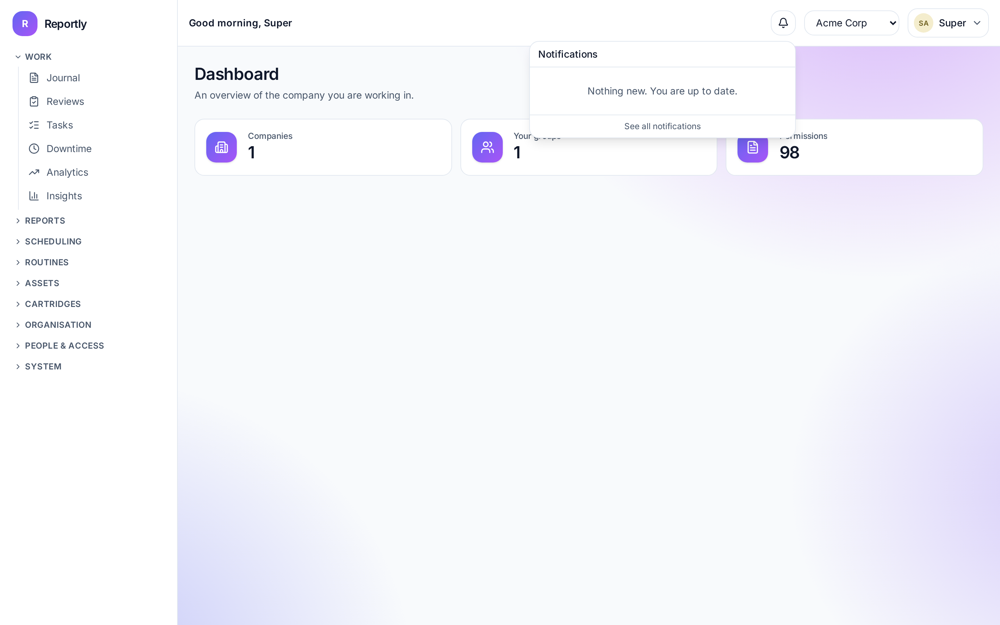
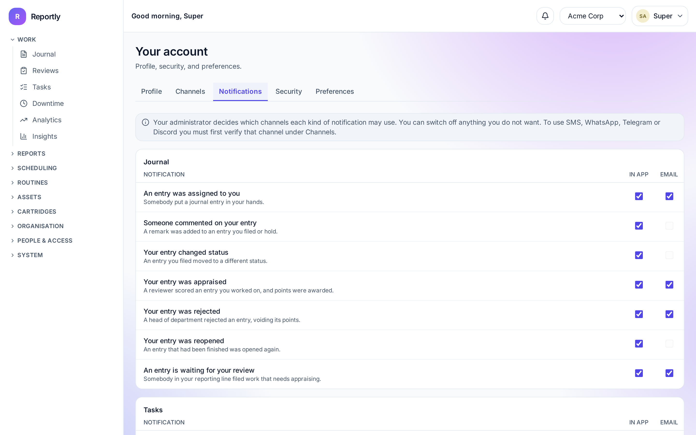
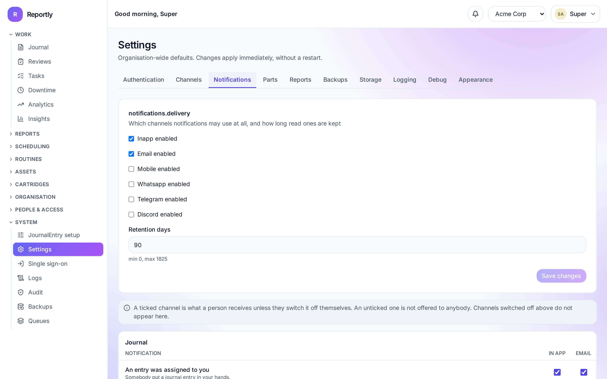

# Notifications

Reportly tells you when something happens that concerns you: an entry lands in
your hands, a colleague asks to swap a shift, your work is appraised. Every
notification appears in the bell at the top of the screen, and can also reach you
by email or one of the messaging channels your organisation has set up.

---

## The bell

The number on the bell is how many notifications you have not read yet. It
refreshes on its own about once a minute, so you do not have to reload the page.

Click it to see the eight most recent. Clicking one takes you to the thing it is
about and marks it read — you do not have to do both.

**See all notifications** opens the full list, where you can filter to unread,
mark things read one at a time or all at once, and remove ones you have finished
with.

Read notifications are tidied away automatically after a while (your
administrator sets how long). Anything you have **not** read is never removed.

### Notifications and companies

If you work in more than one company, the bell shows what belongs to the company
you are currently in. Switch to **All companies** in the top bar to see
everything at once.

---

## Choosing what you receive

**Your account → Notifications** is a grid: the kinds of notification down the
side, the channels across the top. Tick a box to receive that kind on that
channel; untick it to stop.

Press **Save preferences** when you are done — nothing is saved as you click.

### Why a box might be greyed out

Two different reasons, and they need different fixes:

| What you see                                                | What it means                                             | What to do                                              |
| ----------------------------------------------------------- | --------------------------------------------------------- | ------------------------------------------------------- |
| The box is greyed and says your administrator turned it off | Your organisation does not send that kind on that channel | Ask an administrator — you cannot switch it on yourself |
| The box is greyed and asks you to verify the channel        | You have not proved that phone number or handle yet       | Go to **Your account → Channels** and verify it         |

Only email and the in-app bell work out of the box. SMS, WhatsApp, Telegram and
Discord each need two things: your administrator has to configure a provider, and
you have to verify your own address on that channel.

### A box you tick back on

Ticking a box back on does not just re-enable it for you — it puts that cell back
to _following the default_. So if your administrator later changes what everyone
receives for that kind of notification, you will follow the change. Leaving a box
unticked is a decision that sticks.

---

## What Reportly notifies you about

| Group    | You are told when                                                                                                                                                                     |
| -------- | ------------------------------------------------------------------------------------------------------------------------------------------------------------------------------------- |
| Journal  | an entry is assigned to you; somebody comments on yours; its status changes; it is appraised, rejected or reopened; somebody in your reporting line files work that needs your review |
| Tasks    | a task is assigned to you; a task you hold falls due within a day                                                                                                                     |
| Shifts   | a colleague asks to swap with you; your swap is approved or refused; your department's roster is published                                                                            |
| Routines | a routine of yours is due tomorrow; one has gone past its date unlogged; month-end routine points are awarded to you                                                                  |
| Downtime | downtime is opened or closed on your department's equipment                                                                                                                           |
| System   | a backup fails; background jobs are failing; somebody is invited (administrators only)                                                                                                |

You are never notified about something you did yourself.

### Reminders are said once

The due-soon and overdue reminders come from a job that runs once a day, and each
one is sent **once per occurrence**. A routine you have not logged does not
reappear every morning until you do — you are told once, and told again only when
the next occurrence of that routine comes round.

Two consequences worth knowing:

- Moving a task's due date counts as a new deadline, so you will be reminded
  about it again.
- A reminder that is more than a week old is not sent at all. If you turn Reportly
  on against months of existing work, you are not buried in a year of history.

**Not notifications:** password resets, two-factor changes and invitations are
sent by email regardless of anything on this page. They are security messages
about your account, and there is deliberately no way to switch them off.

---

## For administrators

**Settings → Notifications** has two parts.

**Delivery** is the master switch for each channel, plus how long a read
notification is kept.

- **In app** and **Email** are on by default.
- **SMS, WhatsApp, Telegram, Discord** are off by default, because they need a
  provider configured under **Settings → Channels** first. Switching one on
  without a provider does not fail loudly — every message simply fails in the
  background — so leave it off until the provider works.
- **Retention days** removes _read_ notifications older than that. `0` keeps them
  for ever. Unread ones are never removed.

**The matrix** below it sets, per kind of notification, which channels it goes
out on. What you tick here is two things at once:

- **the default** — anybody who has not changed their own preferences gets
  exactly this, including people who joined before you changed it
- **the ceiling** — a person can switch off any of it, but cannot switch on a
  channel you did not tick

Changing the matrix therefore changes what most of your organisation receives
immediately. Somebody who has explicitly unticked a box keeps their choice.

A channel switched off under Delivery does not appear in the matrix at all.

### Troubleshooting

**"Somebody says they got no email."** Check in this order:

1. **Settings → Notifications → Delivery** — is Email enabled?
2. **The matrix** — is Email ticked for that kind of notification?
3. **Their preferences** — they may have unticked it themselves.
4. **The mail server** — run `cli doctor` on the server. Mail is queued, so a
   broken relay shows up as silence, not as an error on screen.

**"Nothing at all arrives, not even the bell."** The notification worker runs
inside the API process. Check the API is running and Redis is reachable
(`cli doctor` covers both). Notifications are queued, so if Redis is down they
are not lost immediately — but the queue does not drain until it comes back.

**"Somebody is getting too much."** Point them at **Your account →
Notifications** first. If a whole kind of notification is noisy for everybody,
untick its channels in the matrix rather than asking people to mute it one by
one.
